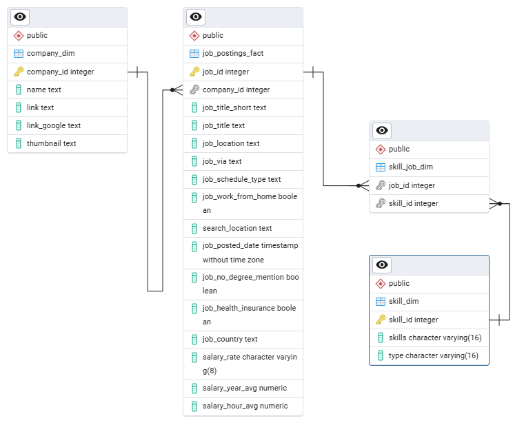

# Job Postings 2023 - SQL

## 📌Table of Contents
- [Overview](#overview)
- [Objective](#objective)
- [Project Structure](#project-structure)
- [SQL Database](#sql-database)
    - [Database Schema](#database-schema)
    - [ERD Diagram](#erd-diagram)
    - [Data Analysis](#data-analysis)
- [Conclusion](#conclusion)
- [Tools & Technologies](#tools--technologies)
- [How to Run This Project](#how-to-run-this-project)
- [Next Steps](#next-steps)
- [Author & Contact](#author--contact)

---

## Overview
<p align="justify">
In this project, I worked with a Job Postings Database for 2023 to study Data Analyst roles. I used PostgreSQL to run queries and find insights about the skills required and salary ranges. The goal is to help job seekers, recruiters, and businesses better understand the demand and pay trends in the job market.
</p>

---

## Objective
1. Database Setup – Create the database and tables, then load the dataset from a CSV file into the SQL database.
2. Job Role Analysis – Run SQL queries to explore and extract insights from the Data Analyst job postings.

--- 

## Project Structure
```
Job-Postings-2023-SQL-Project/
│
├── 1) CSV File /           #CSV Data
│      ├── company_dim.csv
│      ├── job_postings_fact.csv
│      ├── skills_dim.csv
│      └── skills_job_dim.csv
│
├── 2) Datasets /           #Database
│       ├── 1) Database.sql
│       └── 2) Table.sql   
│   
├── job_erd.png
├── Questions.sql           
├── README.md
├── Job_Postings_SQL_Analysis.sql
│

```

---

## SQL Database

### Database Schema
- Database Creation

```sql
CREATE DATABASE job_postings_2023;
```

- Table Creation

1. Table with all Company Information

```sql
DROP TABLE IF EXISTS company_dim;

CREATE TABLE IF NOT EXISTS company_dim(
	 company_id 	INT 	PRIMARY KEY,
	 name 			TEXT,
	 link 			TEXT,
	 link_google 	TEXT,
	 thumbnail 		TEXT
);

COPY company_dim(company_id,name,link,link_google,thumBnail)
FROM 'D:\VCE\Sagar BCC\1) GIT HUB\2) SQL\1) Data Analysis Portifolio\6) Job_postings_2023\1) CSV Files\company_dim.csv'
DELIMITER ','
HEADER CSV;

SELECT * FROM company_dim;
```

2. Table with all Job Information

```sql
DROP TABLE IF EXISTS job_postings_fact;

CREATE TABLE IF NOT EXISTS job_postings_fact(
	  job_id 					INT 	PRIMARY KEY,
	  company_id 				INT,
	  job_title_short 			TEXT,
	  job_title 				TEXT,
	  job_location 				TEXT,
	  job_via 					TEXT,
	  job_schedule_type 		TEXT,
	  job_work_from_home 		BOOLEAN,
	  search_location 			TEXT,
	  job_posted_date 			TIMESTAMP,
	  job_no_degree_mention 	BOOLEAN,
	  job_health_insurance 		BOOLEAN,
	  job_country 				TEXT,
	  salary_rate 				VARCHAR(8),
	  salary_year_avg 			NUMERIC,
	  salary_hour_avg 			NUMERIC,

	  FOREIGN KEY(company_id) REFERENCES company_dim(company_id)
);
	  
COPY job_postings_fact(job_id,company_id,job_title_short,job_title,job_location,job_via,job_schedule_type,job_work_from_home,search_location,job_posted_date,job_no_degree_mention,job_health_insurance,job_country,salary_rate,salary_year_avg,salary_hour_avg)
FROM 'D:\VCE\Sagar BCC\1) GIT HUB\2) SQL\1) Data Analysis Portifolio\6) Job_postings_2023\1) CSV Files\job_postings_fact.csv'
DELIMITER ','
HEADER CSV;  

SELECT * FROM job_postings_fact;
```

3. Table with all Skill requirement

```sql
DROP TABLE IF EXISTS skill_dim;

CREATE TABLE IF NOT EXISTS skill_dim(
	  skill_id 		INT 	   PRIMARY KEY,
	  skills 		VARCHAR(16),
	  type 			VARCHAR(16)
);

COPY skill_dim(skill_id,skills,type)
FROM 'D:\VCE\Sagar BCC\1) GIT HUB\2) SQL\1) Data Analysis Portifolio\6) Job_postings_2023\1) CSV Files\skills_dim.csv'
DELIMITER ','
HEADER CSV; 

SELECT * FROM skill_dim;
```

4. Table with order_id and skill_id

```sql
DROP TABLE IF EXISTS skill_job_dim;

CREATE TABLE IF NOT EXISTS skill_job_dim(
	  job_id 	INT,
	  skill_id 	INT,

	  FOREIGN KEY(job_id) REFERENCES job_postings_fact(job_id),
	  FOREIGN KEY(skill_id) REFERENCES skill_dim(skill_id)	    
);

COPY skill_job_dim(job_id,skill_id)
FROM 'D:\VCE\Sagar BCC\1) GIT HUB\2) SQL\1) Data Analysis Portifolio\6) Job_postings_2023\1) CSV Files\skills_job_dim.csv'
DELIMITER ','
HEADER CSV; 

SELECT * FROM skill_job_dim;
```

---

### ERD Diagram



---

### Data Analysis

1. **Retrieve the top 10 highest-paid Data Analyst jobs.**
    - Exclude records with NULL salary values.
     - Only include jobs where the location is 'Anywhere'.

```sql
SELECT 
	j.job_id,
	j.company_id,
	c.name,
	j.job_title_short,
	j.job_title,
	j.job_location,
	j.salary_year_avg 
FROM job_postings_fact j LEFT JOIN company_dim c ON j.company_id=c.company_id
WHERE j.job_location IN ('Anywhere')
	  AND
	  j.job_title_short ILIKE ('%Data Analyst%')
	  AND
	  j.salary_year_avg IS NOT NULL
ORDER BY j.salary_year_avg DESC
LIMIT 10;
```

2. **Retrieve the top 10 highest-paid Data Analyst jobs.**
    - Exclude records with NULL salary values.
    - Only include jobs where the location is 'Anywhere'.
    - What skill is required for the post.

```sql
SELECT 
	j.job_id,
	j.company_id,
	j.job_title_short,
	j.job_title,
	s.skills,
	j.job_location,
	j.salary_year_avg 
FROM job_postings_fact j LEFT JOIN skill_job_dim sj ON j.job_id=sj.job_id
						 LEFT JOIN skill_dim s      ON sj.skill_id=s.skill_id
WHERE j.job_location IN ('Anywhere')
	  AND
	  j.job_title_short ILIKE ('%Data Analyst%')
	  AND
	  j.salary_year_avg IS NOT NULL
ORDER BY j.salary_year_avg DESC
LIMIT 10;
```

3. **What are top 5 most demand skill for Data Analyst role**

```sql
SELECT
	sj.skill_id,
	s.skills,
	COUNT(j.job_id) AS job_count
FROM job_postings_fact j LEFT JOIN skill_job_dim sj ON j.job_id=sj.job_id
						 LEFT JOIN skill_dim s      ON sj.skill_id=s.skill_id
WHERE j.job_title_short ILIKE ('%Data Analyst%')
GROUP BY 1,2
ORDER BY 3 DESC
LIMIT 5;
```

4. **What are the top 10 highest-paying job postings for the 'Data Analyst' role that require SQL skills?**

```sql
SELECT
	j.job_id,
	j.company_id,
	c.name,
	j.job_title_short,
	j.job_title,
	s.skills,
	j.salary_year_avg
FROM job_postings_fact j JOIN skill_job_dim sj ON j.job_id=sj.job_id
						 JOIN skill_dim s      ON sj.skill_id=s.skill_id
						 JOIN company_dim c    ON j.company_id=c.company_id
WHERE j.salary_year_avg IS NOT NULL
	  AND
	  s.skills IN ('sql')
ORDER BY j.salary_year_avg DESC
LIMIT 10;
```

5. **Most demand and highest paying skill for Data Analyst**

```sql
SELECT
	sj.skill_id,
	s.skills,
	COUNT(j.job_id) AS job_count,
	ROUND(AVG(salary_year_avg),2) AS averge_salary
FROM job_postings_fact j LEFT JOIN skill_job_dim sj ON j.job_id=sj.job_id
						 LEFT JOIN skill_dim s      ON sj.skill_id=s.skill_id
WHERE j.job_title_short ILIKE ('%Data Analyst%')
	  AND
	  j.salary_year_avg IS NOT NULL
GROUP BY 1,2
ORDER BY 3 DESC
LIMIT 1;
```

6. **How many Data Analyst job postings were made in each month?**

```sql
SELECT
	EXTRACT(YEAR FROM job_posted_date::DATE) AS year,
	TO_CHAR(job_posted_date::DATE,'YYYY-MM') AS year_month,
	TO_CHAR(job_posted_date::DATE,'MONTH') AS monthname,
	COUNT(job_id) AS job_counts	
FROM job_postings_fact
WHERE job_title_short ILIKE ('%Data Analyst%')
GROUP BY 1,2,3
ORDER BY 1 ASC, 2 ASC;
```

7. **Added a new column based on salary.find all location _category for data anlayst**

```sql
SELECT 
	job_id,
	company_id,
	job_title_short,
	job_title,
	job_location,
	salary_year_avg,
	CASE
		WHEN salary_year_avg >= 100000 THEN 'Desired'
		WHEN salary_year_avg >= 50000 THEN 'High'
		WHEN salary_year_avg >= 30000 THEN 'Standard'
		else 'Low'
	END AS category
FROM job_postings_fact 
WHERE job_title_short ILIKE ('%Data Analyst%')
	  AND
	  salary_year_avg IS NOT NULL;
```

8. **Find the company has most data analyst job opening**
     - total number oj job(per customner_id) return with customer_name

```sql
SELECT 
	j.company_id,
	c.name,
	COUNT(j.job_id) AS total_job
FROM job_postings_fact j FULL JOIN company_dim c ON j.company_id=c.company_id
WHERE job_title_short ILIKE ('%Data Analyst%')
GROUP BY 1,2
ORDER BY 3 DESC;
```	  

---
## Conclusion


This project showcases the most in-demand skills for the data analyst job roles. Those skills are SQL, Excel, Python, and Tableau or Power BI.

- Excel: When the dataset had fewer than 1 million records, it worked well for quick checks, cleaning, and simple visualizations.
- SQL: The main tool used to handle large amounts of data stored in databases.
- Python: Collecting data from different sources and different formats. It is a powerful tool for data analysis, and its use extends far beyond simple searching and manipulation.
- Power BI / Tableau:  Both tools help get quick insights by extracting and visualizing data. They also combine information from different sources, giving a complete view of a dataset.


---

## Tools & Technologies

- Database: Local Database
- SQL Queries: DDL, DML, Aggregations, Joins and Window Functions.
- Tools 
    - DBMS: PostGres SQL
    - SQL Editor: pgAdmin4

---

## How to run this project

- Install a Postgres SQL.
- Create a Database Schema and tables using the relational structure.
- Insert CSV data into the Database.
- Use SQL queries to solve the provided tasks.

---

## Next Steps
- Visualize the Results: Import your query outputs into tools like Tableau or Power BI to build interactive dashboards.
- Grow the Dataset: Add more sample records to the database.

---

## Author & Contact

**Sagar Kumar Mandle**   
📧 Email: sagarmandle11135@gmail.com 

🔗 [LinkedIn](https://www.linkedin.com/in/sagar-kumar-mandle-7086ba366/)